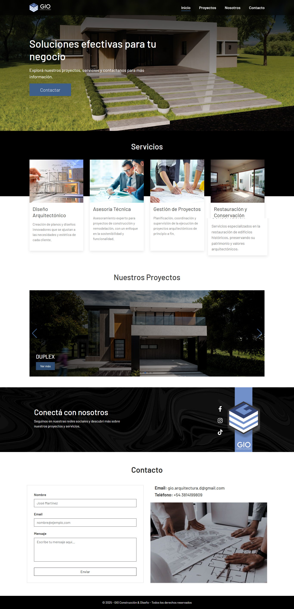

# 🏛️ Portfolio de Arquitectura - Frontend

Este proyecto es el frontend de un portfolio de arquitectura profesional, desarrollado con **React**, que permite mostrar proyectos con galería de imágenes, información detallada y un formulario de contacto. Está pensado para ser elegante, responsive y fácil de mantener.

## 🚀 Demo

🔗 [https://gioarqui.com](https://gioarqui.com) 

---

## 🛠️ Tecnologías utilizadas

- **React**
- **React Router DOM** – Navegación entre páginas
- **Axios** – Comunicación con el backend
- **React Hook Form** + **Yup** – Validación de formularios
- **React-Bootstrap** – Componentes estilizados
- **Swiper.js** – Carrusel para mostrar proyectos
- **Yet Another React Lightbox** – Galería de imágenes ampliable
- **SweetAlert2** – Alertas modernas y atractivas
- **React Loading Skeleton** – Indicadores de carga mientras se renderiza contenido
- **CSS personalizado** – Estilos adaptados al diseño del cliente

---

## ⚙️ Instalación

### 1. Clonar el repositorio

```bash
git clone https://github.com/frandg47/gio-frontend.git
cd gio-frontend
```

### 2. Instalar dependencias

```bash
npm install
```

### 3. Crear archivo de entorno

Crear un archivo `.env` en la raíz del proyecto con el siguiente contenido:

```env
VITE_API_URL=http://localhost:4000/api
```

> Asegurate de que el backend esté corriendo en esa dirección.

### 4. Iniciar el servidor de desarrollo

```bash
npm run dev
```

---

## ✨ Funcionalidades

- ✅ Página principal con introducción
- ✅ Listado de proyectos en cards
- ✅ Detalles de proyecto con descripción e imágenes ampliables
- ✅ Formulario de contacto con validación
- ✅ Efecto hover en galería con animación y texto "ver"
- ✅ Carga de datos con skeletons
- ✅ Responsive design adaptado a todos los dispositivos

---

## 📦 Instalación rápida de dependencias clave

```bash
npm install axios react-router-dom react-bootstrap react-hook-form yup swiper sweetalert2 react-loading-skeleton yet-another-react-lightbox
```

---

## 🖼️ Captura de pantalla

> Agregar una imagen o gif demostrativo  
> Ejemplo:



---

## 🧩 Backend relacionado

Este frontend se comunica con un backend desarrollado en **Node.js + MongoDB**.

📂 [Repositorio del backend](https://github.com/frandg47/gio-backend)

---

## 📧 Contacto

Desarrollado por Franco Giacobbe  
✉️ [frandg47@gmail.com](mailto:frandg47@gmail.com)  
🌐 [https://tuportafolio.dev](https://tuportafolio.dev)

---

## 📝 Licencia

Este proyecto está bajo la licencia MIT. Libre para uso personal y comercial.
